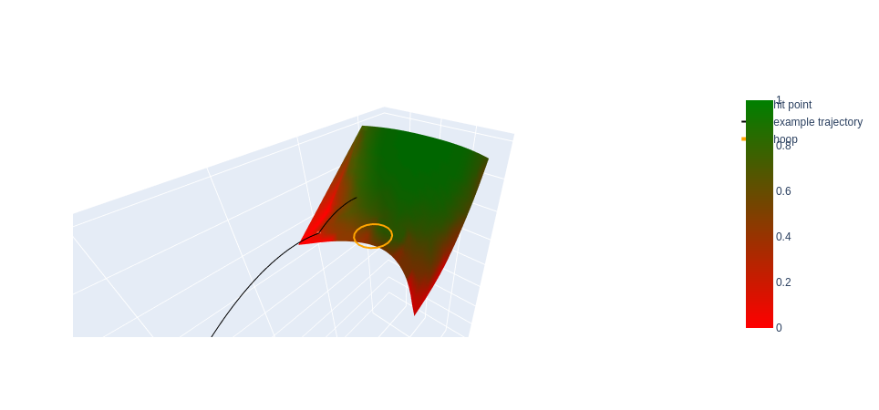

# Optimal Basketball Backboard.

Inspired by this excellent [video](https://www.youtube.com/watch?v=vtN4tkvcBMA)

This is alternative approach to the Stuff Made Here. He computes the optimal angle per grid point and then has a process to make it in to a continuous surface. I start with a continuous surface parametrized as a polynomial and use a global optimization algorithm to decide the parameters. Mine is not a Monte-Carlo, I test every grid point, over a range of vertical velocities.

The constraints on mine are also a little different. My backboard projects onto the regulation size backboard, and in my optimization I only consider shots from the free throw line, however like the original I only consider arcing shots, and I also consider direct hits (with no rebound). I consider the basketball as a particle rather than a sphere, and don't take into account multiple bounces or hoop collision. (TODO verify my result with Unity physics engine)

In this setup the optimized backboard achieves ~75% of shots in the hoop, compared to 5% with the original.
The plot generated shows greener if more shots land in the hoop.

